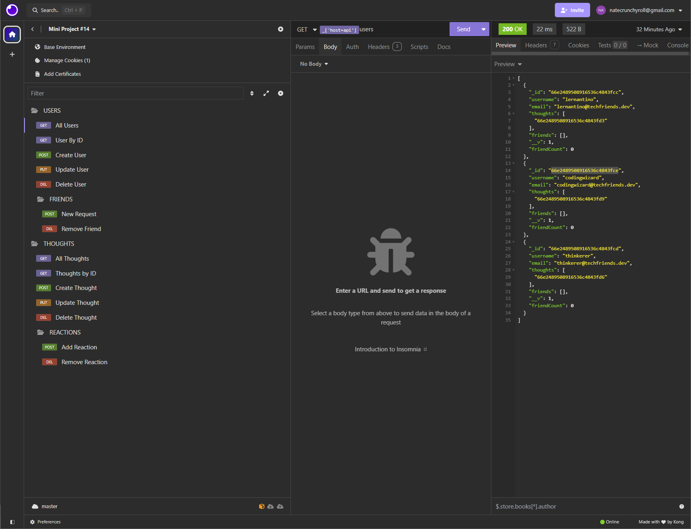
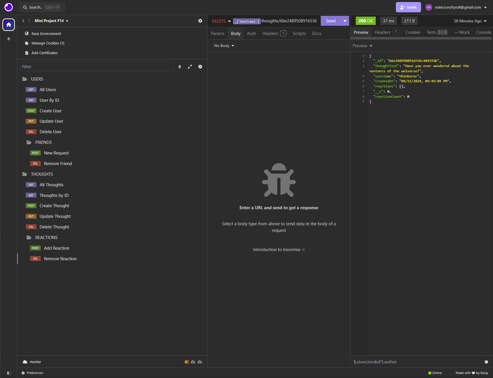

# NoSQL Social Network API

[](https://opensource.org/licenses/MIT)

[Watch the Demo Video](https://drive.google.com/file/d/1dWSRkcyA-EaCo3056WESCbKoEQ9-xAyq/view?usp=sharing)

## What is This Project?

This project is a Node.js application that serves as an API for a social network using a NoSQL database (MongoDB).

- **Why Did I Make This?**: To enhance my skills in building APIs with Node.js and Express.js, and to gain experience working with NoSQL databases, specifically MongoDB and Mongoose ODM.
- **What's in It?**: The application allows users to share thoughts, react to friends' thoughts, create a friend list, and manage user and thought data. All data is stored in a MongoDB database.
- **What Did I Learn?**: This project helped me understand the intricacies of working with NoSQL databases, creating and managing data models with Mongoose, and implementing CRUD operations in a social network context.

## Table of Contents

Explore the contents of this guide:

- [Installation](#installation)
- [Usage](#usage)
- [Credits](#credits)
- [License](#license)

## Installation

To run this project locally:
1. Clone the repository.
2. Navigate to the project directory.
3. Install the dependencies using `npm install`.
4. Ensure MongoDB is installed and running on your machine.

## Usage

1. Start the MongoDB server.
2. Create the database:
    ```bash
    use socialNetworkDB
    ```
3. Seed the database with initial data (if available):
    ```bash
    npm run seed
    ```
4. Start the application:
    ```bash
    npm start
    ```
5. Use Insomnia to test the API endpoints:
    - **GET** `/api/users` to view all users.
    - **GET** `/api/users/:userId` to view a single user by ID.
    - **POST** `/api/users` to create a new user.
    - **PUT** `/api/users/:userId` to update a user by ID.
    - **DELETE** `/api/users/:userId` to delete a user by ID.
    - **POST** `/api/users/:userId/friends/:friendId` to add a friend.
    - **DELETE** `/api/users/:userId/friends/:friendId` to remove a friend.
    - **GET** `/api/thoughts` to view all thoughts.
    - **GET** `/api/thoughts/:thoughtId` to view a single thought by ID.
    - **POST** `/api/thoughts` to create a new thought.
    - **PUT** `/api/thoughts/:thoughtId` to update a thought by ID.
    - **DELETE** `/api/thoughts/:thoughtId` to delete a thought by ID.
    - **POST** `/api/thoughts/:thoughtId/reactions` to add a reaction.
    - **DELETE** `/api/thoughts/:thoughtId/reactions/:reactionId` to remove a reaction.

## Sample Screenshots

Here are some screenshots demonstrating the application's functionality:

### GET Request
 

### DELETE Request


## Credits

A heartfelt thank you to my bootcamp instructors and peers for their continuous guidance and support. Special thanks to:

- [MDN Web Docs](https://developer.mozilla.org/en-US/) for their comprehensive resources on JavaScript and web development.
- [Stack Overflow](https://stackoverflow.com/) for providing solutions to coding challenges.
- [Node.js Documentation](https://nodejs.org/en/docs/) for detailed information on Node.js features.
- [Express.js Documentation](https://expressjs.com/) for guidance on building web applications with Node.js.
- [MongoDB Documentation](https://docs.mongodb.com/) for in-depth information on working with MongoDB.
- [Mongoose Documentation](https://mongoosejs.com/docs/) for detailed guides on Mongoose ODM.
- [Insomnia Documentation](https://docs.insomnia.rest/) for instructions on testing API endpoints.

## License

MIT License 

Permission is hereby granted, free of charge, to any person obtaining a copy of this software and associated documentation files (the "Software"), to deal in the Software without restriction, including without limitation the rights to use, copy, modify, merge, publish, distribute, sublicense, and/or sell copies of the Software, and to permit persons to whom the Software is furnished to do so, subject to the following conditions:

The above copyright notice and this permission notice shall be included in all copies or substantial portions of the Software.

THE SOFTWARE IS PROVIDED "AS IS", WITHOUT WARRANTY OF ANY KIND, EXPRESS OR IMPLIED, INCLUDING BUT NOT LIMITED TO THE WARRANTIES OF MERCHANTABILITY, FITNESS FOR A PARTICULAR PURPOSE AND NONINFRINGEMENT. IN NO EVENT SHALL THE AUTHORS OR COPYRIGHT HOLDERS BE LIABLE FOR ANY CLAIM, DAMAGES, OR OTHER LIABILITY, WHETHER IN AN ACTION OF CONTRACT, TORT OR OTHERWISE, ARISING FROM, OUT OF OR IN CONNECTION WITH THE SOFTWARE OR THE USE OR OTHER DEALINGS IN THE SOFTWARE.